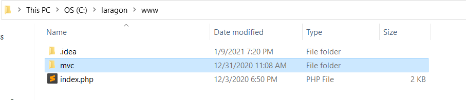
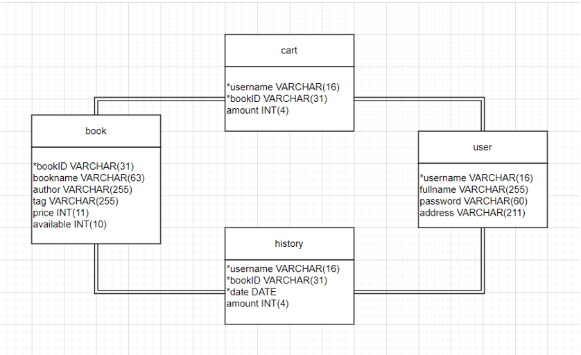

# **Website bán sách online theo mô hình MVC**
GV hướng dẫn: TS. Đào Thành Chung
SV thực hiện: Nguyễn Anh Tú - 20184000

## Mục tiêu
Xây dựng website bán sách online bằng theo mô hình MVC hướng back-end.

## Công nghệ sử dụng
* Ngôn ngữ lập trình: PHP, HTML, CSS.
* Các kiến thức về lập trình theo mô hình MVC.

## Hướng dẫn cài đặt
### Cài đặt môi trường
Cài đặt Laragon tại [đây](https://laragon.org/download/).
Kiểm tra phiên bản PHP, Apache và MySQL hiện tại. Trang web này sử dụng phiên bản PHP 7.2, Apache 2.4, MySQL 5.7. Nếu không tương thích, tìm hiểu cách cài đặt các phiên bản [PHP](https://forum.laragon.org/topic/166/tutorial-how-to-add-another-php-version), [Apache](https://forum.laragon.org/topic/165/tutorial-how-to-add-another-apache-version) và [MySQL](https://forum.laragon.org/topic/164/tutorial-how-to-add-another-mysql-version) khác.

### Sử dụng mã nguồn
Download thư mục `src`  ở dạng file zip và giải nén.

Copy toàn bộ thư mục `mvc` dán vào trong thư mục `www` của Laragon.


Sử dụng phần mềm quản lý cơ sở dữ liệu HeidiSQL được tích hợp sẵn trong Laragon tạo cơ sở dữ liệu với các thông tin như sau:
````php
<?php
define('DB_HOST',     'localhost');
define('DB_USER',     'root');
define('DB_PASSWORD', '');
define('DB_DATABASE', 'ecommerce');
?>
````


Sau đó, thêm các thông tin về sản phẩm vào trong database `book` để sinh dữ liệu test.


## Hướng dẫn sử dụng
Sử dụng trình duyệt đi đến địa chỉ http://localhost/mvc để bắt đầu sử dụng.
Một số tính năng liên quan đến tương tác giữa sản phẩm và người dùng chỉ có thể sử dụng sau khi người dùng đã tạo tài khoản và đăng nhập.

## Demo video
Xem video demo tại [đây](media/demo.mp4).
